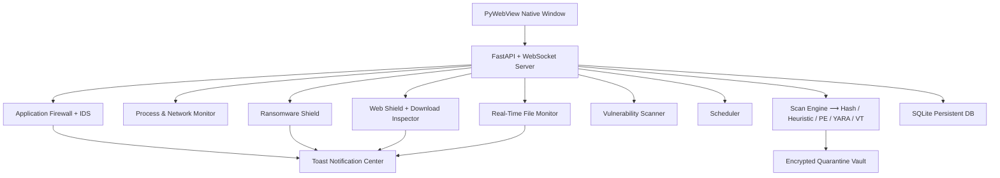

# Aegis AV — Next-Gen Open-Source Security Suite

[](https://opensource.org/licenses/MIT)
[](https://www.python.org/)
[]()

Aegis AV is a high-performance, resource-efficient, and visually stunning open-source
antivirus and security suite. It pairs multi-engine file scanning with a download
inspector, an application firewall, a ransomware shield, a system-vulnerability
scanner, a process & network inspector, and a real-time security-score gauge — all
wrapped in a premium PyWebView desktop UI.

---

## The Mission

> **"I am a student who got tired of corporate antivirus paywalls and aggressive ads."**
>
> Most modern AV apps have become bloated, expensive, and noisy — locking basic
> features like firewalls and ransomware shields behind subscriptions. Aegis is
> 100% free, open-source, ad-free, and pop-up-free. Security is a basic right,
> not a subscription service.

---

## What's New in 2.1

| Module                  | What it does                                                                  |
|-------------------------|-------------------------------------------------------------------------------|
| **Web & Download Shield** | URL reputation checker + auto-scan every new download with toast alerts.   |
| **Application Firewall**  | Per-process egress monitor with block rules (IP / host / port / process).  |
| **Intrusion Detection**   | Detects port scans, C2 beacons, Tor exits, and blocked-rule hits.          |
| **Ransomware Shield**     | Behavior monitor on protected folders (mass-modify, ransom extensions).    |
| **System Vulnerabilities**| Defender state, Firewall profiles, pending updates, SMBv1, UAC, BitLocker…  |
| **Process Manager**       | Live process list, suspicious tagging, one-click kill.                     |
| **Startup Manager**       | View / remove Windows Run-key & Startup-folder entries.                    |
| **Network Inspector**     | All TCP/UDP sessions + interfaces + cumulative I/O counters.               |
| **USB Auto-Scan**         | Newly inserted removable media is scanned automatically.                   |
| **Scheduler**             | Daily / weekly / boot-time scans with timer-based dispatch.                |
| **Password Health**       | Offline strength scoring + Have-I-Been-Pwned k-anonymity check.            |
| **Threat Intel Feed**     | Rotating curated cards on current campaigns.                               |
| **Reports & Analytics**   | Chart.js dashboards for threats / scans / severity / engine breakdown.     |
| **Security Score**        | 7-pillar 0-100 score with grade + recommendations, animated SVG gauge.     |
| **Notification Center**   | Toast pop-ups + persisted history; muteable Game Mode.                     |
| **Command Palette**       | Press **Ctrl+K** to jump anywhere or run an action.                        |

---

## Core Features (carried over from 2.0)

- **Multi-Engine Scanner**: hash, heuristic, PE analyzer, YARA, optional VirusTotal cloud.
- **Real-Time File Protection**: watchdog-based monitor, auto-scan on create/modify.
- **Encrypted Quarantine Vault**: XOR-encoded inert container with restore/purge.
- **Whitelist Engine**: path + SHA-256 rules, auto-restore on whitelist match.
- **Performance Optimizer**: temp + browser cache cleanup, registry analysis.
- **High-Performance Server**: FastAPI + WebSocket; thread-local SQLite (100MB cache).
- **Native Desktop Window**: PyWebView wrapper, no browser required.

---

## Architecture



---

## Installation & Run

Requires **Python 3.10+** on Windows 10/11.

```bash
git clone https://github.com/testaccount344-bit/aegis-av.git
cd aegis-av
pip install -r requirements.txt
python main.py
```

For best results run as administrator so the Vulnerability Scanner can access
Defender / BitLocker / Update APIs and the Firewall can read all PIDs.

---

## Keyboard Shortcuts

| Shortcut       | Action                                |
|----------------|---------------------------------------|
| `Ctrl + K`     | Open command palette / quick search   |
| `Esc`          | Close palette / modal / dialog        |

---

## REST + WebSocket API surface

Aegis ships **63 REST endpoints** and a `/ws` WebSocket. Highlights:

| Endpoint                          | Purpose                              |
|-----------------------------------|--------------------------------------|
| `GET /api/security-score`         | Aggregated 7-pillar score            |
| `POST /api/scan/start`            | Quick / full / custom / boot scan    |
| `POST /api/web-shield/check-url`  | URL reputation verdict               |
| `POST /api/firewall/rules`        | Add an IP / host / port / proc rule  |
| `POST /api/ransomware/folders`    | Add a protected folder               |
| `GET  /api/vulnerabilities`       | Full system audit (cached 5 min)     |
| `GET  /api/processes?sort=cpu`    | Live process snapshot                |
| `POST /api/password-health`       | Strength + breach check              |
| `GET  /api/reports`               | 14-day analytics for the Reports tab |
| `WS   /ws`                        | Live telemetry, monitor events, toasts |

A full OpenAPI doc is available at `http://127.0.0.1:8000/docs` while the app
is running.

---

## Contributing

Bug fixes, signature contributions, UI polish — all welcome. Open an issue
with the `enhancement` label and let's discuss.

Let's make Aegis AV the ultimate FOSS security suite together.
