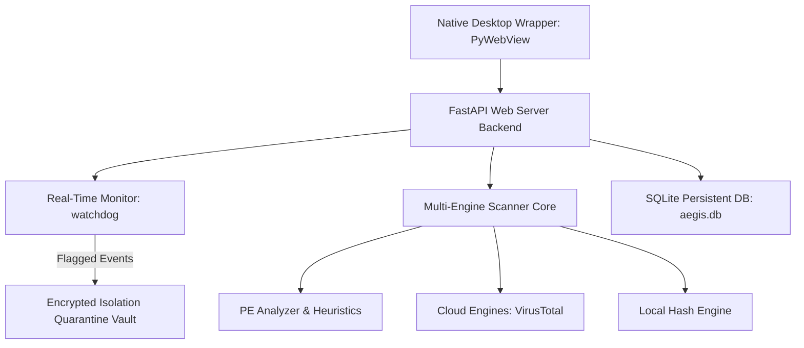

# 🛡️ Aegis AV — Next-Gen Open-Source Security Suite

[](https://opensource.org/licenses/MIT)
[](https://www.python.org/)
[]()

Aegis AV is a high-performance, resource-efficient, and visually stunning open-source antivirus and security suite. It features multi-engine heuristic file scanning, active real-time defense monitoring, custom whitelist controls with automated isolated restorations, system telemetry, and a built-in safe performance optimizer.

---

## 💡 The Mission & Origin

> **"I am a student who got tired of corporate antivirus paywalls and aggressive ads."**
> 
> Most modern corporate antivirus applications have become bloated, expensive, and spam you with constant popups urging you to buy premium subscriptions. Some even lock basic features (like registry cleanups, firewalls, or automatic threat isolation) behind paywalls. 
> 
> I built **Aegis AV** to escape that cycle. It is a 100% free, open-source, ad-free, and popup-free alternative built with modern tech stack. Security is a basic right, not a subscription service. 

---

## Key Core Features

- **Multi-Engine Threat Scanning**: Highly responsive scanning utilizing local fast cryptographic hashes, PE (Portable Executable) structural analyzer, active heuristic signature rules, and optional VirusTotal Cloud Verification.
- **Active Real-Time Defense**: Built-in file system monitors that watch, intercept, scan, and quarantine infected files instantly upon creation or modification.
- **Smart Isolation Vault (Quarantine)**: Inert, encrypted, and isolated storage of quarantined files to protect the operating system.
- **Advanced Whitelisting & Auto-Restoration**: Exclude directories, files, or SHA-256 hashes. Adding a whitelist path rule automatically matches and instantly restores matching quarantined files back to their original locations.
- **Performance Optimizer Core**: Safe and rapid cleanup of junk caches and dead system registries, returning computers to peak performance.
- **Network Telemetry & Process Watcher**: Real-time visual metrics of open network ports, CPU and RAM hardware allocation, active processes, and background security states.
- **Standalone Native Desktop App**: Wrapped in a desktop environment using `PyWebView` for smooth transitions and a premium native look.

---

## 🏗️ Architecture Layout



---

## ⚙️ How to Install & Run

Ensure you have **Python 3.10+** installed on your Windows system.

### 1. Clone the Repository
```bash
git clone https://github.com/testaccount344-bit/aegis-av.git
cd aegis-av
```

### 2. Install Dependencies
```bash
pip install -r requirements.txt
```

### 3. Run Aegis AV
Simply execute the main wrapper script to start the desktop suite:
```bash
python main.py
```

---

## 🚧 Student Project Disclaimer & Contributions

This is a student-built project! While it has been thoroughly optimized and refined, there may still be bugs, edge cases, or features that need polishing. 

I have big plans to make it even better, including:
* Adding advanced local signature rules (YARA-based integration).
* Enhancing kernel-level or process-isolation hooks.
* Refining custom optimization algorithms.

### 🤝 We're Open to Collaborations!
If you want to help make the internet a safer, ad-free place:
* **Bug Fixes**: Found an issue? Submit a PR or open an Issue!
* **Feature Requests**: Have an idea for a cool security widget or scanning metric? Let's discuss it!
* **General Polish**: We're highly open to code refactoring and performance updates.

Let's make Aegis AV the ultimate FOSS security suite together! 🌟
